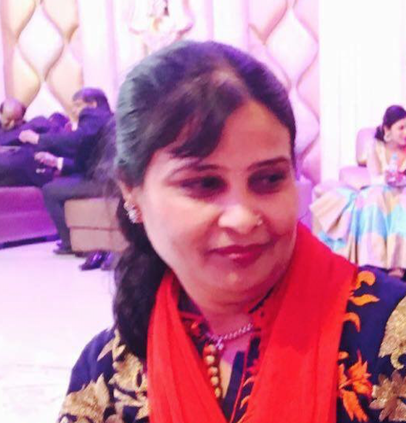

```ngMeta
name: Part I Basics
completionMethod: automatic
```



# Part I...  Basics
- Aapko _[yeh](https://github.com/vidur149/angular-multifunctional/issues/1)_ issue resolve karna hai. Issue resolve karne se pehle iss slide ko padho.

- Angular use karne ke liye sabse pehle humien usse apne Html document mein include karna hoga.

- Iss [link](https://angularjs.org/) par jaaye, aur angularJs ko apne computer mein download kar le. Aur downloaded file ko apni html file mein include kar le.

- Firr, right mei diye gaye code ko dekh kar apne Html mei changes kare.

- **ng-app** se angular ko pata chalta hai ki hum angular ki app bana rahe hai.

- **Double curly braces (yaani "{{")** mein jo likha hai usse angular expression bolte hai.

- Jaruri Concepts:
    - Including Angular [en](http://fdietz.github.io/recipes-with-angular-js/introduction/including-the-angular-library-code-in-an-html-page.html
), hi, [video](https://egghead.io/lessons/first-step-adding-to-project)  
    - Angular Expression [en](https://www.w3schools.com/angular/angular_expressions.asp), hi  
    - Angular module  [en](https://www.w3schools.com/angular/angular_modules.asp), hi  

```html
<!doctype html>
<html ng-app="multiFun">
<head>
	<title>
        Ecommerce
    </title>
    <script src="angular ka path"></script>
</head>
    <body>
	    {{ 1 + 2 }}
	    <script>
var app = angular.module("multiFun", []);
        </script>
        </body>
</html>
```